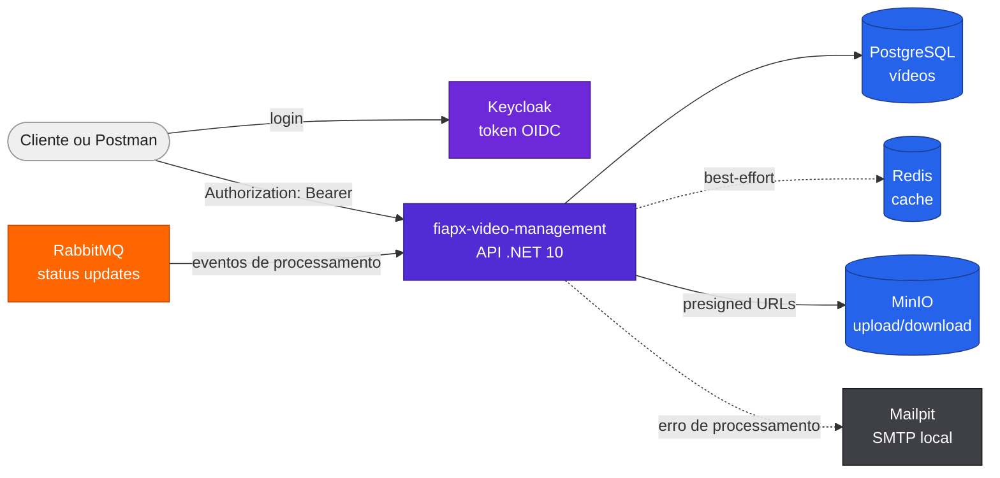

# fiapx-video-management

API HTTP da solução FiapX para autenticar requisições, registrar vídeos, gerar URLs pré-assinadas de upload/download, consultar status e refletir eventos de processamento.

[]()
[]()
[](postman/fiapx-video-management.postman_collection.json)
[](https://github.com/fabianorodrigues/fiapx-video-management/actions/workflows/ci.yml)
[](https://github.com/fabianorodrigues/fiapx-video-management/actions/workflows/cd.yml)

## Sumário

- [Visão geral](#visão-geral)
- [Arquitetura](#arquitetura)
- [Configuração](#configuração)
- [Execução local isolada](#execução-local-isolada)
- [Autenticação](#autenticação)
- [Endpoints](#endpoints)
- [Swagger e Postman](#swagger-e-postman)
- [CI/CD](#cicd)
- [Validação](#validação)
- [Próxima etapa](#próxima-etapa)

---

## Visão geral

Este repositório implementa a API da solução FiapX. Ela é a entrada HTTP para o usuário final e mantém a fonte de verdade dos metadados do vídeo.

Para configuração e provisionamento do ambiente integrado, consulte o [fiapx-infra](https://github.com/fabianorodrigues/fiapx-infra).

| Responsabilidade | Implementação |
| --- | --- |
| Autenticação | JWT Bearer validado contra o realm `fiapx` do Keycloak |
| Upload | `POST /videos` registra o vídeo e devolve presigned URL `PUT` para o MinIO |
| Status | `GET /videos` e `GET /videos/{videoId}` consultam o PostgreSQL com cache Redis best-effort |
| Download | `GET /videos/{videoId}/download` devolve presigned URL quando o status é `CONCLUIDO` |
| Eventos | Consumer RabbitMQ atualiza status a partir de `video.processing.started`, `completed` e `failed` |
| Notificação | Falha de processamento dispara e-mail best-effort via SMTP/Mailpit |

**Tecnologias:** .NET 10, ASP.NET Core Minimal APIs, Entity Framework Core, Npgsql, PostgreSQL, Redis, RabbitMQ.Client, AWSSDK.S3, MinIO, Keycloak, Swagger/OpenAPI, Postman, Mailpit e Docker.

---

## Arquitetura



A API não processa vídeo. Ela registra o upload, controla autorização por usuário, atualiza status a partir de eventos e entrega a URL de download do ZIP final.

---

## Configuração

Para configuração e provisionamento do ambiente integrado, consulte o [fiapx-infra](https://github.com/fabianorodrigues/fiapx-infra).

Variáveis consumidas pela API nos Compose atuais:

| Variável | Classificação | Uso |
| --- | --- | --- |
| `POSTGRES_CONNECTION_STRING` | MANUAL OBRIGATÓRIO fora do Compose | Persistência EF Core |
| `REDIS_CONNECTION_STRING` | OPCIONAL | Cache de listagem/detalhe; falha não derruba a requisição |
| `JWT_METADATA_ADDRESS`, `JWT_ISSUER`, `JWT_AUDIENCE` | MANUAL OBRIGATÓRIO fora do Compose | Validação JWT |
| `MINIO_INTERNAL_ENDPOINT`, `MINIO_PUBLIC_ENDPOINT` | MANUAL OBRIGATÓRIO fora do Compose | Cliente interno e URL pública das presigned URLs |
| `MINIO_ACCESS_KEY`, `MINIO_SECRET_KEY`, `MINIO_BUCKET`, `MINIO_REGION` | MANUAL OBRIGATÓRIO fora do Compose | Acesso ao bucket |
| `PRESIGNED_URL_EXPIRES_SECONDS` | OPCIONAL | Expiração das URLs pré-assinadas |
| `SMTP_HOST`, `SMTP_PORT`, `SMTP_FROM` | OPCIONAL | Notificação de falha |
| `RABBITMQ_HOST`, `RABBITMQ_PORT`, `RABBITMQ_USERNAME`, `RABBITMQ_PASSWORD`, `RABBITMQ_VHOST` | MANUAL OBRIGATÓRIO fora do Compose | Consumer de status |
| `STATUS_MAX_ATTEMPTS`, `STATUS_RETRY_DELAY_MS` | OPCIONAL | Retry de eventos de status |

Credenciais DEMO presentes nos arquivos versionados de Compose/fixtures são exclusivamente DEMO/local, existem propositalmente para demonstração e não devem ser usadas em ambiente real.

---

## Execução local isolada

Este repositório possui um Compose local para desenvolvimento da API sem depender do Worker nem do ambiente integrado.

```powershell
docker compose -f docker-compose.local.yml up -d --build
```

Para parar preservando volumes:

```powershell
docker compose -f docker-compose.local.yml down
```

Serviços locais:

| Serviço | URL |
| --- | --- |
| API | `http://localhost:8080` |
| Swagger UI | `http://localhost:8080/swagger` |
| Keycloak | `http://localhost:8081` |
| MinIO API | `http://localhost:9000` |
| MinIO Console | `http://localhost:9001` |
| RabbitMQ Management | `http://localhost:15672` |
| Mailpit | `http://localhost:8025` |
| PostgreSQL | `localhost:5432` |
| Redis | `localhost:6379` |

As portas são as mesmas do ambiente integrado. Execute apenas um dos ambientes por vez quando usar os defaults.

---

## Autenticação

Todos os endpoints `/videos` exigem:

```http
Authorization: Bearer <access_token>
```

Condição validada no código:

- `Program.cs` usa JWT Bearer.
- `MetadataAddress`, `Issuer` e `Audience` vêm de configuração.
- A API exige as claims `sub` e `email`.
- O `UserId` da aplicação é o claim `sub`, não o nome de usuário.

Usuários DEMO oficiais versionados nas fixtures locais:

| Usuário | E-mail |
| --- | --- |
| `usertest1` | `usertest1@fiapx.local` |
| `usertest2` | `usertest2@fiapx.local` |

As senhas DEMO desses usuários estão versionadas propositalmente nas fixtures locais para demonstração, são exclusivamente DEMO/local e não devem ser usadas em ambiente real.

Exemplo de token no ambiente local:

```powershell
$token = (Invoke-RestMethod `
  -Method Post `
  -Uri 'http://localhost:8081/realms/fiapx/protocol/openid-connect/token' `
  -ContentType 'application/x-www-form-urlencoded' `
  -Body @{
    grant_type = 'password'
    client_id = 'fiapx-postman'
    username = 'usertest1'
    password = 'fiapx_usertest1_demo_password'
  }).access_token
```

---

## Endpoints

| Verbo | Rota | Autenticação | Resultado |
| --- | --- | --- | --- |
| `GET` | `/health` | Não | Health check da API |
| `POST` | `/videos` | Sim | Cria registro `RECEBIDO` e devolve `uploadUrl` |
| `GET` | `/videos` | Sim | Lista vídeos do usuário autenticado |
| `GET` | `/videos/{videoId}` | Sim | Consulta detalhe do vídeo do usuário |
| `GET` | `/videos/{videoId}/download` | Sim | Devolve `downloadUrl` se o vídeo estiver `CONCLUIDO` |

Criar vídeo:

```powershell
$body = @{
  fileName = 'video.mp4'
  contentType = 'video/mp4'
} | ConvertTo-Json

$video = Invoke-RestMethod `
  -Method Post `
  -Uri 'http://localhost:8080/videos' `
  -Headers @{ Authorization = "Bearer $token" } `
  -ContentType 'application/json' `
  -Body $body
```

Enviar o arquivo para a URL retornada:

```powershell
Invoke-WebRequest `
  -Method Put `
  -Uri $video.uploadUrl `
  -ContentType 'video/mp4' `
  -InFile '.\video.mp4'
```

Consultar status:

```powershell
Invoke-RestMethod `
  -Method Get `
  -Uri "http://localhost:8080/videos/$($video.videoId)" `
  -Headers @{ Authorization = "Bearer $token" }
```

Baixar o resultado quando o status estiver `CONCLUIDO`:

```powershell
$download = Invoke-RestMethod `
  -Method Get `
  -Uri "http://localhost:8080/videos/$($video.videoId)/download" `
  -Headers @{ Authorization = "Bearer $token" }

Invoke-WebRequest -Method Get -Uri $download.downloadUrl -OutFile .\resultado.zip
```

Status retornados pela API:

| Status | Significado |
| --- | --- |
| `RECEBIDO` | Registro criado e aguardando upload/evento |
| `PROCESSANDO` | Worker iniciou processamento |
| `CONCLUIDO` | ZIP final disponível |
| `ERRO` | Processamento falhou; notificação é tentada via SMTP |

---

## Swagger e Postman

### Swagger

Condição real de disponibilidade:

- `Program.cs` registra Swagger/OpenAPI.
- `UseSwagger()` e `UseSwaggerUI()` são habilitados somente quando `app.Environment.IsDevelopment()`.
- Os Compose atuais deste repositório e da infra definem `ASPNETCORE_ENVIRONMENT=Development` para a API.

Nesses modos locais por Compose:

```text
http://localhost:8080/swagger
```

Em ambiente que não esteja com `ASPNETCORE_ENVIRONMENT=Development`, o Swagger UI não é habilitado por esta aplicação.

### Postman

Arquivos versionados:

- [Collection Postman](postman/fiapx-video-management.postman_collection.json)
- [Environment local](postman/fiapx-video-management.local.postman_environment.json)

Como usar:

1. Suba o ambiente integrado pelo [fiapx-infra](https://github.com/fabianorodrigues/fiapx-infra) ou o Compose local deste repositório.
2. Importe a collection e o environment no Postman.
3. Selecione o environment `fiapx-video-management Local`.
4. Configure `videoFilePath` com o caminho completo de um arquivo `.mp4` local.
5. Ajuste no environment os dois conjuntos de credenciais de usuário para os usuários DEMO oficiais `usertest1` e `usertest2`.
6. Rode a collection `FIAP X - fiapx-video-management` no Runner, em ordem.

O Runner valida:

- `/health`;
- login real no Keycloak;
- token com `sub`, `email`, `iss`, `aud` e `exp`;
- criação de vídeo `RECEBIDO`;
- upload real no MinIO usando a URL retornada pela API;
- listagem e detalhe por usuário autenticado;
- caminho de cache Redis na segunda listagem;
- bloqueio de download antes de `CONCLUIDO`;
- respostas `400`, `401`, `404` e isolamento entre usuários.

Para o fluxo ponta a ponta com Worker, use o ambiente integrado da infra, envie o vídeo, aguarde `CONCLUIDO`, baixe `resultado.zip` e valide os frames no arquivo.

---

## CI/CD

### CI

O workflow `.github/workflows/ci.yml` roda em `ubuntu-24.04` para:

- `pull_request`;
- `push` na branch `main`;
- `workflow_dispatch`.

Pipeline:

1. Configura .NET 10.
2. Executa restore com `NuGet.Config`.
3. Compila a solution `FiapX.VideoManagementService.sln`.
4. Executa testes xUnit e publica `.trx` como artifact.
5. Faz build Docker da API.
6. Em `push main` com CI verde, publica imagem no GHCR.

A publicação gera tag com o SHA do commit e também `latest`. O deploy usa a imagem por SHA imutável; `latest` não é a referência operacional do CD.

### CD

O workflow `.github/workflows/cd.yml` roda por `workflow_run` depois do CI verde em `main`. Ele usa `head_sha`, valida se o commit ainda é o HEAD atual da `main` e só então executa no runner self-hosted Windows com labels:

```text
self-hosted, Windows, X64, fiap-fase5
```

Variável necessária:

```text
DEPLOY_INFRA_PATH=<CAMINHO_DA_WORKING_COPY_DA_INFRA>
```

O script `.github/scripts/deploy-management.ps1`:

- usa `Global\FiapXDeployLock`;
- exige que o ambiente integrado já exista e esteja com serviços base em execução;
- calcula `DEPLOY_IMAGE=ghcr.io/<owner>/<repo>:<head_sha>`;
- executa migrations antes de recriar a API;
- valida Docker health e `http://localhost:8080/health`;
- preserva containers não alvo;
- só persiste `VIDEO_MANAGEMENT_IMAGE` no `.env` da infra após validação.

---

## Validação

Validação local de build/teste:

```powershell
dotnet restore .\FiapX.VideoManagementService.sln --configfile .\NuGet.Config
dotnet build .\FiapX.VideoManagementService.sln --configuration Release --no-restore
dotnet test .\FiapX.VideoManagementService.sln --configuration Release --no-build
docker compose -f docker-compose.local.yml config --quiet
```

Validação funcional mínima:

1. Suba o ambiente.
2. Valide `GET /health`.
3. Autentique no Keycloak.
4. Chame `POST /videos`.
5. Faça upload do `.mp4` com a `uploadUrl`.
6. Consulte `GET /videos/{videoId}` até `CONCLUIDO`.
7. Chame `GET /videos/{videoId}/download`.
8. Baixe `resultado.zip`.
9. Abra o ZIP e confirme os frames PNG.

---

## Próxima etapa

Após enviar o vídeo, acompanhe o status até `CONCLUIDO` e faça o download do resultado.
